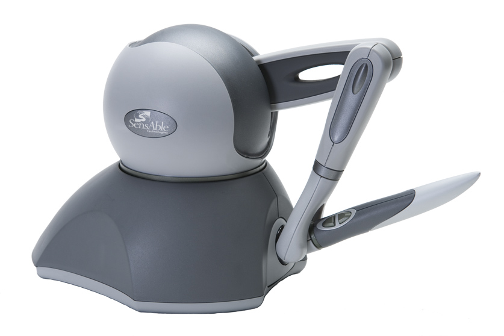

<h1 align="center"> Phantom Omni robotic manipulator </h1>

  

This project implements the remote position control of a Phantom Omni robotic manipulator using modern control techniques. The system is modeled as a master-slave teleoperation setup, with nonlinear dynamics simplified through linearization. Two controllers—PID and Backstepping—are designed and simulated in Simulink to ensure force and position tracking. State feedback control, pre-compensators (static and dynamic), and full-order observers are developed and validated. Stability is proven via Lyapunov methods, and optimal gain matrices are derived using MATLAB’s symbolic and numerical solvers. The results demonstrate reliable tracking and robustness against disturbances and aging, offering a strong foundation for real-time haptic interaction.

## 📬 Contact

If you have any questions or feedback, feel free to contact us at:

📧 sepehrghamri@gmail.com